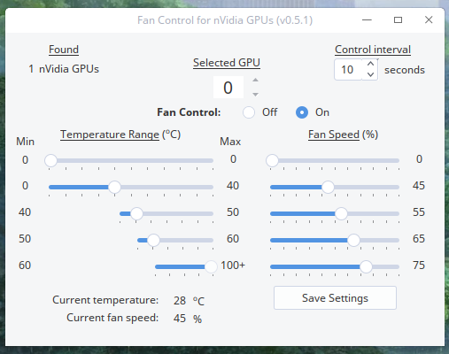

# Nvidia-Fan-Control

[Download the app](https://github.com/oscararg/Nvidia-Fan-Control/releases)

Features
- Made with Python and PyQT4.
- Nvidia GT, GTX and RTX cards supported.
- SLI supported (up to six cards).
- Light, no more than 25MB RAM usage when running.
- Control interval variable between 1 and 120 seconds.

Notes
- Before installing, enable "Coolbits" at Nvidia-Settings options.
- Doesn't work with hybrid graphics solutions like Bumblebee or Prime.
- It needs python-numpy and python-qt4 as dependencies.
- Tested on Debian and Arch based distros (but must work on all Linux distros).

Collaborators:
- Jeff Buck (app creator).
- Car (debian packager).

More info about the app [here (english)](https://bbs.deepin.org/forum.php?mod=viewthread&tid=144008&extra=) or [here (español)](https://deepinenespañol.org/fan-control-para-placas-nvidia/).
